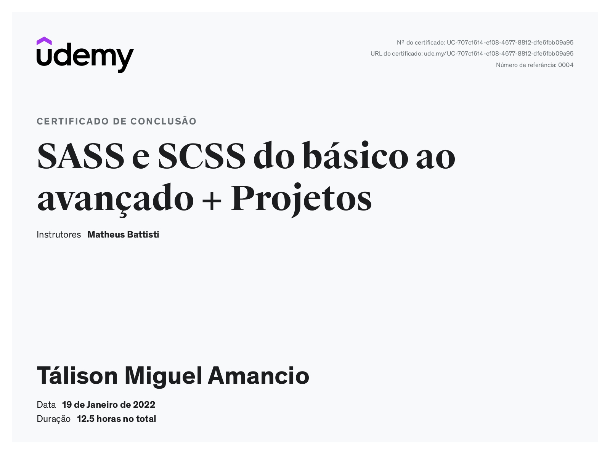

<h1 align="center">
 📘 Curso de SASS e SCSS do básico ao avançado + projetos
</h1>

<p align="center">
  
 
  

  <br>
  
  
  
  

  <a href="https://www.linkedin.com/in/t%C3%A1lison-miguel/">
    
  </a>
</p>

---

<p align="center">
  
</p>

---

#  Índice

- :rocket: [Sobre o Projeto](#rocket-sobre-o-projeto)
- 👨‍💻️ [Tecnogias utilizadas](#%EF%B8%8F-tecnogias-utilizadas)
- 📦️ [Como utilizar o projeto](#%EF%B8%8F-como-utilizar-o-projeto)
---

## :rocket: Sobre o Repositório

Este é um repositório contendo todo conteúdo que fiz do curso, desde funcionalidades do sass até projetos. 

---

## 👨‍💻️ Tecnogias utilizadas

✅ [ SASS ](https://sass-lang.com/install) <br/>
✅ [ CSS ](https://developer.mozilla.org/pt-BR/docs/Web/CSS) <br/>
✅ [ HTML ](https://developer.mozilla.org/pt-BR/docs/Web/HTML) <br/>

### Padronização de código

  - [Arquitetura de Projetos com SASS do Matheus Battisti]
  -  : mouse : [ Editor Config ](https://editorconfig.org/)

###  VAI

  - [ Código do Visual Studio ](https://code.visualstudio.com/)

---

## 📦️ Como utilizar o projeto

Para copiar o projeto, utilize os comandos:

```bash
  ❯ git clone https://github.com/Talison-Miguel/ Curso-De-Sass .git
```

---
